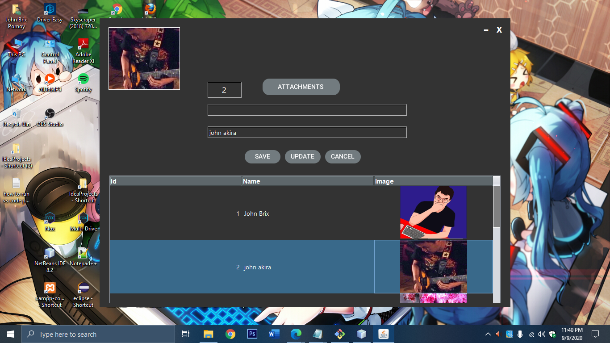

# SaveImagesInMySql
We use a Blob Data type in MySQL to upload a image, then we use a render ImageIcon for the rendering images

<h1>How to install: </h1>

<h3>First:</h3>

- Create a database name "myimg" in mysql.
- Then create a table and paste this code in your Sql Command: 

CREATE TABLE `myimg`.`image`( `id` INT(12) NULL , `name` VARCHAR(50) NOT NULL , `images` INT NOT NULL ) ENGINE = InnoDB;

- Download the project "SaveImagesInMySql and import in Netbeans".
- Download this "Mysql-connector-java-5.1.23-bin.jar and add this in your libraries in Netbeans. 
- Second, Download rojerusan libraries for Rectangle button, Link: http://plugins.netbeans.org/plugin/73577/rojerusan-parte1
- Add your libraries in Tools/Palette/ Swing /AWT Components your rojerusan library.

<h3>Second This is just a Optional:</h3

-If ever you want a upload a big images like 3.6mb or higher something, the default of max_allowed_packet is
"1048576" so if you want to customized, you need to configure this and go to phpmyadmin and click sql then paste:

- this allowed you to check your max allowed packet.

show variables like 'max_allowed_packet'

- for 32mb customized storage for big images:

set global max_allowed_packet=33554432 

- once is done paste this again in your sql command

show variables like 'max_allowed_packet'

- now you see you already change it but its just a temporary for security purpose.

<h1>Run your project:  </h1>

